# Azure Infrastructure CI/CD

### Terraform · GitHub Actions · Microsoft Azure · OIDC

> **Production-style Infrastructure as Code and CI/CD implementation demonstrating automated Azure provisioning through GitHub Actions.**

---

## Architecture

```mermaid
flowchart LR
    A[👩‍💻 Developer] --> B[Feature Branch]
    B --> C[Pull Request]

    C --> D[⚙️ Terraform CI]
    D --> D1[Format]
    D1 --> D2[Init]
    D2 --> D3[Validate]
    D3 --> D4[Plan]

    D4 --> E[Code Review]
    E --> F[main]

    F --> G[🚀 Terraform CD]
    G --> H[🔐 OIDC]
    H --> I[Terraform Plan]
    I --> J[Terraform Apply]

    J --> K[☁️ Azure]
    K --> L[Resource Group]
    L --> M[Storage Account]

    style A fill:#24292f,color:#fff
    style C fill:#24292f,color:#fff
    style D fill:#0969da,color:#fff
    style G fill:#0969da,color:#fff
    style H fill:#8250df,color:#fff
    style K fill:#0078D4,color:#fff
```



---

## Project Overview

This project demonstrates an end-to-end **Infrastructure as Code (IaC) and CI/CD workflow** for Microsoft Azure.

The implementation follows a controlled engineering workflow:

```text
Feature Branch
      ↓
Pull Request
      ↓
Terraform CI
      ↓
Code Review
      ↓
Merge to main
      ↓
Terraform CD
      ↓
Azure
```

Terraform defines the infrastructure, while GitHub Actions automates validation, planning and deployment.

---

## Key Capabilities

| Area              | Implementation             |
| ----------------- | -------------------------- |
| ☁️ Cloud          | Microsoft Azure            |
| 🏗️ IaC           | Terraform                  |
| 🔄 CI/CD          | GitHub Actions             |
| 🔐 Authentication | GitHub OIDC                |
| 🛡️ Authorization | Azure RBAC                 |
| 🔑 Identity       | Microsoft Entra ID         |
| 🌿 Git Workflow   | Feature Branch → PR → main |
| 📦 State          | Azure Blob Storage         |

---

## CI Pipeline

Every Pull Request targeting `main` executes:

```text
Terraform Format
       ↓
Terraform Init
       ↓
Terraform Validate
       ↓
Terraform Plan
```

This provides automated infrastructure validation before changes are merged.

---

## CD Pipeline

A successful merge to `main` triggers deployment:

```text
main
 ↓
Azure OIDC Authentication
 ↓
Terraform Init
 ↓
Terraform Validate
 ↓
Terraform Plan
 ↓
Terraform Apply
 ↓
Azure Infrastructure
```

---

## Security

Authentication between GitHub Actions and Azure uses **OpenID Connect (OIDC)** with federated credentials.

```text
GitHub Actions
      │
      │ OIDC Token
      ▼
Microsoft Entra ID
      │
      ▼
Federated Credential
      │
      ▼
Azure Service Principal
      │
      ▼
Azure RBAC
```

This avoids storing a long-lived Azure client secret in the GitHub Actions workflow.

---

## Azure Infrastructure

The current deployment intentionally uses a lightweight architecture:

```text
Azure Subscription
│
└── rg-azure-devops-portfolio
       │
       └── Storage Account
```

Keeping the infrastructure small makes the project suitable for learning and portfolio demonstration while limiting unnecessary Azure costs.

---

## Repository Structure

```text
azure-terraform-github-actions/
│
├── .github/
│   └── workflows/
│       ├── terraform-ci.yml
│       └── terraform-cd.yml
│
├── terraform/
│   ├── main.tf
│   ├── provider.tf
│   ├── variables.tf
│   ├── outputs.tf
│   └── versions.tf
│
├── docs/
│   └── architecture.md
│
├── .gitignore
└── README.md
```

---

## Engineering Practices Demonstrated

* Infrastructure as Code
* Git-based change management
* Feature branch development
* Pull Request review
* Automated Terraform validation
* Terraform plan and apply
* GitHub Actions CI/CD
* OIDC-based Azure authentication
* Azure RBAC
* Remote Terraform state
* Cloud resource lifecycle management

---

## Cost & Cleanup

This project creates Azure resources that may incur charges depending on the subscription and configuration.

When testing is complete, remove the portfolio infrastructure:

```text
Azure Portal
    ↓
Resource Groups
    ↓
rg-azure-devops-portfolio
    ↓
Delete Resource Group
```

**Important:** The Terraform remote-state resources are kept separately and should not be deleted with the portfolio resource group.

---

## Documentation

Technical details are available in:

📐 **[Architecture](docs/architecture.md)**
🔄 **CI/CD Pipeline**
🗄️ **Terraform Remote State**

---

## Roadmap

Future improvements:

* [ ] Remote Terraform state
* [ ] Terraform modules
* [ ] Dev / Test / Production environments
* [ ] Infrastructure security scanning
* [ ] Deployment approvals
* [ ] Azure monitoring
* [ ] Automated infrastructure cleanup

---

## Technology Stack

**Microsoft Azure** · **Terraform** · **GitHub Actions** · **Git** · **Microsoft Entra ID** · **OIDC** · **Azure RBAC** · **YAML**

---

### Portfolio Focus

> **Design → Validate → Review → Deploy → Manage**

This project demonstrates how cloud infrastructure can be managed through a controlled, automated DevOps lifecycle rather than manual Azure Portal deployment.
