# Azure Terraform GitHub Actions – Infrastructure CI/CD

## 📌 Project Overview

This project demonstrates a modern Infrastructure as Code (IaC) and CI/CD workflow for deploying Azure infrastructure using **Terraform and GitHub Actions**.

The project follows a real-world development workflow:

**Feature Branch → Pull Request → Terraform CI → Merge to Main → Terraform CD → Azure**

The infrastructure is intentionally small so that the focus remains on understanding the complete DevOps workflow rather than building a large application.

---

## 🏗️ Architecture

```mermaid
flowchart LR
    A[Developer] --> B[Feature Branch]
    B --> C[Pull Request]
    C --> D[GitHub Actions - Terraform CI]

    D --> D1[Terraform Format]
    D1 --> D2[Terraform Init]
    D2 --> D3[Terraform Validate]
    D3 --> D4[Terraform Plan]

    D4 --> E{PR Approved & Merged}

    E --> F[main Branch]
    F --> G[GitHub Actions - Terraform CD]

    G --> G1[Azure OIDC Login]
    G1 --> G2[Terraform Init]
    G2 --> G3[Terraform Validate]
    G3 --> G4[Terraform Plan]
    G4 --> G5[Terraform Apply]

    G5 --> H[Azure Resource Group]
    H --> I[Azure Storage Account]
```



---

## ☁️ Azure Infrastructure

Terraform creates the following resources:

```text
Azure Subscription
│
└── Resource Group
    │
    └── Storage Account
```

### Resources

| Resource              | Purpose                                    |
| --------------------- | ------------------------------------------ |
| Azure Resource Group  | Logical container for Azure resources      |
| Azure Storage Account | Demonstrates Terraform resource deployment |

The infrastructure is intentionally lightweight and can be expanded later with:

* Azure Virtual Network
* Subnets
* App Service
* Key Vault
* Azure SQL
* Application Gateway
* Load Balancer
* Private Endpoints
* Monitoring

---

# 🔄 CI/CD Workflow

## 1. Feature Branch

Infrastructure changes are developed in a feature branch.

Example:

```text
feature/terraform-infrastructure
```

or

```text
feature/terraform-cd
```

This keeps changes isolated from the production/main branch.

---

## 2. Pull Request

The feature branch is pushed to GitHub and a Pull Request is created against:

```text
main
```

The Pull Request automatically triggers the Terraform CI workflow.

---

## 3. Terraform CI

The CI workflow performs validation before code can be merged.

```text
Pull Request
     │
     ▼
Terraform CI
     │
     ├── Terraform Format Check
     ├── Terraform Init
     ├── Terraform Validate
     └── Terraform Plan
```

This helps catch Terraform syntax, formatting, configuration and infrastructure planning issues before merging.

---

# 🚀 Continuous Deployment

After the Pull Request is approved and merged into `main`, the Terraform CD workflow starts automatically.

```text
main
 │
 ▼
Terraform CD
 │
 ├── Azure Login
 │
 ├── Terraform Init
 │
 ├── Terraform Validate
 │
 ├── Terraform Plan
 │
 └── Terraform Apply
          │
          ▼
        Azure
```

Terraform then creates or updates the infrastructure defined in the Terraform configuration.

---

# 🔐 Authentication – Azure OIDC

This project uses **OpenID Connect (OIDC)** between GitHub Actions and Microsoft Azure.

The workflow does not require an Azure client secret for authentication.

GitHub Actions obtains an OIDC token and Azure validates the token through a configured federated credential.

```text
GitHub Actions
      │
      │ OIDC Token
      ▼
Microsoft Entra ID
      │
      │ Federated Credential
      ▼
Azure Service Principal
      │
      │ Azure RBAC
      ▼
Azure Subscription
```

The GitHub Actions identity is assigned the required Azure RBAC permissions.

For this project, the service principal has the **Contributor** role at the subscription scope.

This allows Terraform to create and manage the required Azure infrastructure.

---

# 📁 Project Structure

```text
azure-terraform-github-actions/
│
├── .github/
│   └── workflows/
│       ├── terraform-ci.yml
│       └── terraform-cd.yml
│
├── terraform/
│   ├── main.tf
│   ├── provider.tf
│   ├── variables.tf
│   ├── outputs.tf
│   ├── versions.tf
│   └── terraform.tfvars.example
│
├── docs/
│
├── scripts/
│
├── .gitignore
└── README.md
```

---

# 🧩 Terraform Files

### `main.tf`

Defines the Azure infrastructure.

Currently:

* Resource Group
* Storage Account

### `provider.tf`

Configures the AzureRM Terraform provider.

### `variables.tf`

Defines configurable Terraform variables such as:

* Azure region
* Resource group name
* Storage account name

### `outputs.tf`

Displays useful information after deployment, such as:

* Resource Group name
* Storage Account name
* Storage Account ID

### `versions.tf`

Defines the Terraform and AzureRM provider version requirements.

---

# ⚙️ GitHub Actions Workflows

## Terraform CI

File:

```text
.github/workflows/terraform-ci.yml
```

Triggered by:

```yaml
pull_request:
  branches:
    - main
```

Purpose:

* Validate Terraform changes
* Run Terraform plan
* Prevent invalid infrastructure code from being merged

---

## Terraform CD

File:

```text
.github/workflows/terraform-cd.yml
```

Triggered when changes are pushed to:

```yaml
main
```

Purpose:

* Authenticate to Azure
* Initialize Terraform
* Validate configuration
* Generate Terraform plan
* Apply infrastructure changes

---

# 🛡️ Security Practices Demonstrated

This project demonstrates several important DevOps practices:

* Infrastructure as Code with Terraform
* Git-based version control
* Feature branch workflow
* Pull Request review
* Automated CI validation
* Automated infrastructure deployment
* GitHub Actions
* Azure OIDC authentication
* Azure RBAC
* No Azure client secret stored in Terraform code
* Terraform state excluded from Git
* `.terraform` directory excluded from Git

---

# 💰 Azure Cost Management

This project creates Azure resources that may incur charges depending on the Azure subscription and resource configuration.

**Always check your Azure resources after completing testing.**

For a small portfolio project, resources should be removed when they are no longer required.

---

# 🧹 How to Clean Up Azure Resources

## Option 1 – Delete the Resource Group from Azure Portal

For this small portfolio project, the simplest cleanup method is to delete the entire Resource Group.

In Azure Portal:

```text
Azure Portal
   ↓
Resource Groups
   ↓
rg-azure-devops-portfolio
   ↓
Delete Resource Group
```

The Resource Group contains the Terraform-created resources.

Deleting the Resource Group removes the resources inside it.

### ⚠️ Important

Before deleting it, make sure there are **no other resources you need** inside:

```text
rg-azure-devops-portfolio
```

Then confirm deletion.

---

# 🧹 Terraform Destroy

Normally, Terraform can remove infrastructure using:

```powershell
terraform destroy
```

or:

```powershell
terraform destroy -auto-approve
```

However, Terraform needs access to the **same Terraform state** that was used when the infrastructure was created.

For this project, the current GitHub Actions workflow does not yet use a remote Terraform backend.

Therefore, the GitHub-hosted runner does not retain the Terraform state after the workflow finishes.

### For the current version of this project

For cleanup after a GitHub Actions deployment, deleting the Azure Resource Group from the Azure Portal is the simplest approach.

---

# 🔜 Future Improvement – Remote Terraform State

A production-style implementation should use a remote Terraform backend.

For example:

```text
Azure Storage Account
        │
        └── Terraform State
                │
                ▼
        GitHub Actions
                │
                ▼
             Terraform
                │
                ▼
              Azure
```

A remote backend would allow different CI/CD runs to share the same Terraform state safely.

This is an important next step for making the project more production-like.

---

# 🧪 Example Development Workflow

A typical infrastructure change follows this process:

```text
1. Create feature branch
        ↓
2. Modify Terraform
        ↓
3. Commit changes
        ↓
4. Push feature branch
        ↓
5. Create Pull Request
        ↓
6. Terraform CI runs
        ↓
7. Review CI results
        ↓
8. Merge Pull Request
        ↓
9. Terraform CD runs
        ↓
10. Terraform Apply
        ↓
11. Infrastructure updated in Azure
```

---

# 🎯 Skills Demonstrated

This project demonstrates practical experience with:

**Cloud**

* Microsoft Azure
* Azure Resource Groups
* Azure Storage

**Infrastructure as Code**

* Terraform
* AzureRM provider
* Terraform variables
* Terraform outputs
* Terraform plan/apply

**CI/CD**

* GitHub Actions
* Pull Requests
* Continuous Integration
* Continuous Deployment

**Security**

* Microsoft Entra ID
* OIDC
* Federated Credentials
* Azure RBAC

**Git**

* Feature branches
* Pull Requests
* Merge workflow
* `.gitignore`

---

# 📈 Possible Future Enhancements

The project can be extended to demonstrate a more complete Azure infrastructure platform.

Potential additions:

```text
Azure VNet
   │
   ├── Web Subnet
   ├── Application Subnet
   └── Private Endpoint Subnet
          │
          ├── App Service
          ├── Key Vault
          └── Azure SQL
```

Additional DevOps improvements could include:

* Azure Storage remote Terraform state
* Terraform plan artifact
* Manual approval before production deployment
* Separate Dev/Test/Production environments
* Terraform modules
* Environment-specific variables
* Security scanning
* Checkov or tfsec
* Dependabot
* Azure Monitor
* Deployment notifications

---

# 👩‍💻 Project Purpose

This project was created as a practical Cloud/DevOps portfolio project to demonstrate how infrastructure can be managed using **Infrastructure as Code and automated CI/CD practices**.

The focus is not simply on creating Azure resources, but on demonstrating the complete engineering workflow:

**Code → Review → Validate → Plan → Merge → Deploy → Manage**

---
