# Azure Infrastructure CI/CD with Terraform & GitHub Actions


## Overview

A practical **Azure Infrastructure as Code and CI/CD project** using Terraform and GitHub Actions.

The project demonstrates a real-world workflow:

**Feature Branch → Pull Request → CI → Merge → CD → Azure**

Terraform provisions Azure infrastructure while GitHub Actions automates validation, planning and deployment.

---

## Architecture

```mermaid
flowchart LR
    A[Developer] --> B[Feature Branch]
    B --> C[Pull Request]

    C --> D[Terraform CI]
    D --> D1[Format]
    D1 --> D2[Init]
    D2 --> D3[Validate]
    D3 --> D4[Plan]

    D4 --> E[Merge to main]

    E --> F[Terraform CD]
    F --> G[Azure OIDC]
    G --> H[Terraform Plan]
    H --> I[Terraform Apply]

    I --> J[Azure]
    J --> K[Resource Group]
    K --> L[Storage Account]
```



---

## What This Project Demonstrates

### Infrastructure as Code

* Terraform
* AzureRM provider
* Variables and outputs
* Reproducible Azure infrastructure

### CI/CD

* GitHub Actions
* Feature branches
* Pull Request workflow
* Automated Terraform validation
* Terraform plan
* Automated deployment

### Cloud Security

* Microsoft Entra ID
* GitHub OIDC
* Federated credentials
* Azure RBAC
* No long-lived Azure client secret

## Azure Resources

Current infrastructure:

```text
Azure Subscription
│
└── Resource Group
    └── Storage Account
```

The infrastructure is intentionally lightweight to demonstrate the complete DevOps lifecycle while keeping Azure costs under control.

---

## Project Structure

```text
azure-terraform-github-actions/
│
├── .github/workflows/
│   ├── terraform-ci.yml
│   └── terraform-cd.yml
│
├── terraform/
│   ├── main.tf
│   ├── provider.tf
│   ├── variables.tf
│   ├── outputs.tf
│   └── versions.tf
│
├── docs/
│   └── architecture.md
│
├── .gitignore
└── README.md
```

---

## Deployment Flow

```text
Feature Branch
      ↓
Pull Request
      ↓
Terraform CI
      ↓
Code Review
      ↓
Merge to main
      ↓
Terraform CD
      ↓
Azure
```

---

## Cleanup

Azure resources should be removed when the project is no longer being used to avoid unnecessary charges.

For the portfolio infrastructure:

**Azure Portal → Resource Groups → `rg-azure-devops-portfolio` → Delete Resource Group**

The Terraform remote-state storage account should be kept separately.

---

## Future Improvements

* Separate Dev/Test/Production environments
* Terraform modules
* Security scanning
* Deployment approvals
* Azure monitoring
* Automated `terraform destroy` workflow

---

## Technologies

**Azure · Terraform · GitHub Actions · Git · Microsoft Entra ID · OIDC · Azure RBAC · YAML**

---

## Project Goal

Demonstrate practical Cloud/DevOps skills by implementing:

**Infrastructure as Code + Git Workflow + CI/CD + Cloud Authentication + Automated Azure Deployment**
